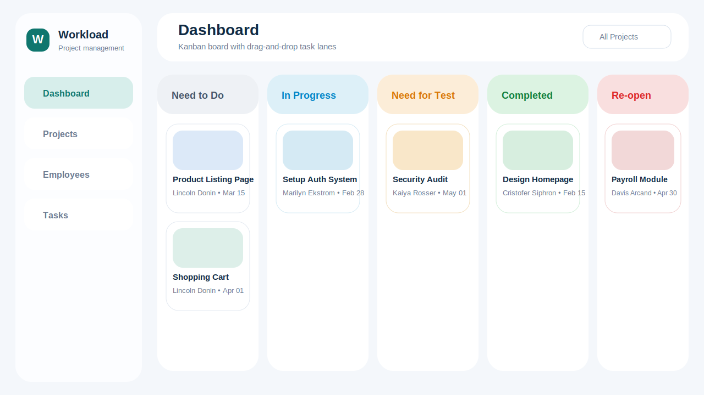
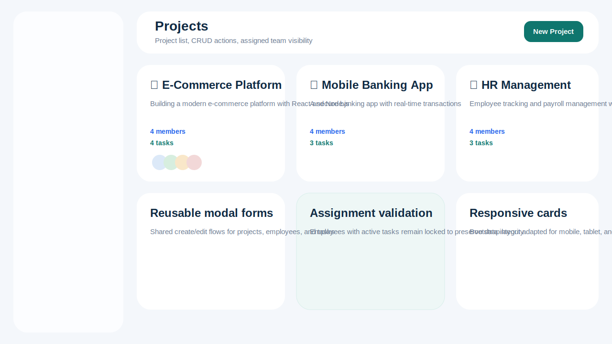
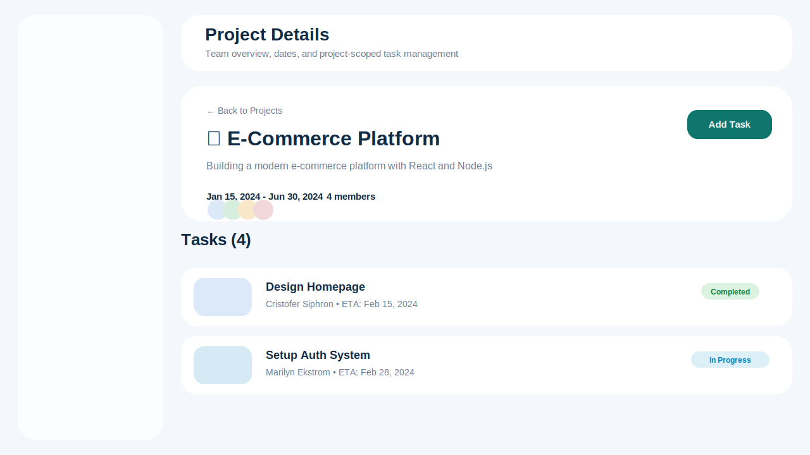

# Project Management Dashboard

A responsive project management dashboard built with React, Context API, Bootstrap, drag-and-drop task lanes, and fully validated CRUD flows for employees, projects, and tasks.

## Overview

This app covers the technical task brief with:

- Employee CRUD with unique official email validation
- Project CRUD with employee assignment and date/time validation
- Task CRUD linked to existing projects and scoped to project-assigned employees
- Dashboard board view with drag-and-drop across `Need to Do`, `In Progress`, `Need for Test`, `Completed`, and `Re-open`
- Project filter support on the dashboard
- Shared modal-driven forms powered by React Hook Form + Yup

## Tech Stack

- React 18
- Vite
- React Router DOM v6
- Context API
- `@hello-pangea/dnd`
- React Hook Form + Yup
- Bootstrap 5

## Setup

1. Install dependencies:

```bash
npm install
```

2. Start the development server:

```bash
npm run dev
```

3. Build for production:

```bash
npm run build
```

4. Run the test suite:

```bash
npm run test
```

## Screenshots

Replace these preview assets with locally captured screenshots or a GIF before external submission.

### Dashboard



### Projects



### Project Detail



## Submission Notes

- GitHub repository link: add your hosted repository URL before submission
- Screen recording: attach your recorded walkthrough in the submission form
- Live deployment: add the deployed URL if you publish the app
